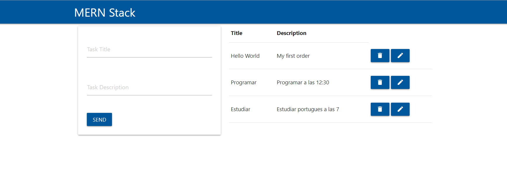
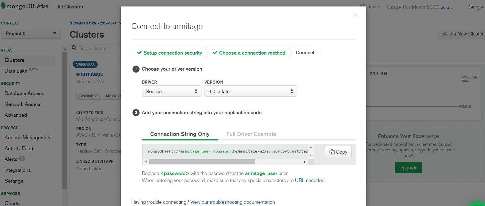
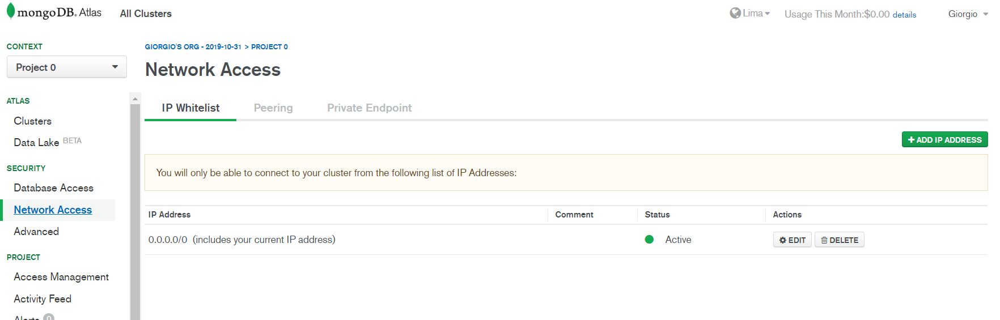
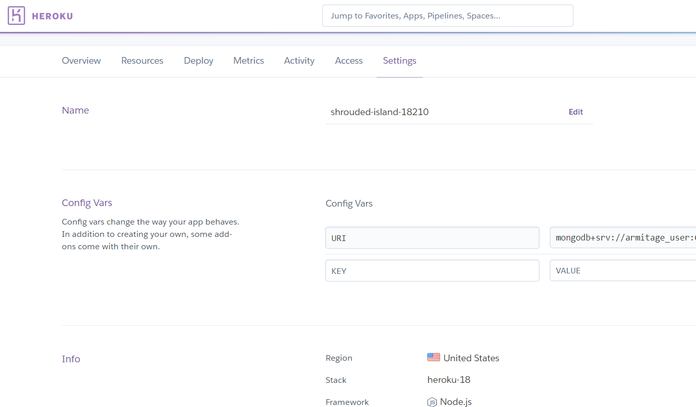

# App CRUD
 Esta App tiene frontend en React, el backend en NodeJS Express, base de datos Atlas Mongo DB y como servidor Heroku.

[Ver la aplicación](https://shrouded-island-18210.herokuapp.com/)

## ¿Cómo funciona?
Requiere Node JS 10.X

* `npm install` para instalar las dependencias

## Configuración Mongo Atlas DB
- Crear un cluster y una base de datos dentro del servicio.
- Apuntar usuario y contraseña para la conexión con la aplicación.
- Copiar la url generada y aplicar la dirección en la configuración de Heroku.
- Imagen referencial para la conexión con la App

- Otro punto importante es la configuración de la red, en este ejemplo se esta permitiendo todas las conexiones, pero se podría elegir IP's específicas.

## Configuración Heroku
- Es importante tener las siguientes consideraciones a la hora de desplegar la aplicación.
- Configuración o Settings

## Licencia 
MIT